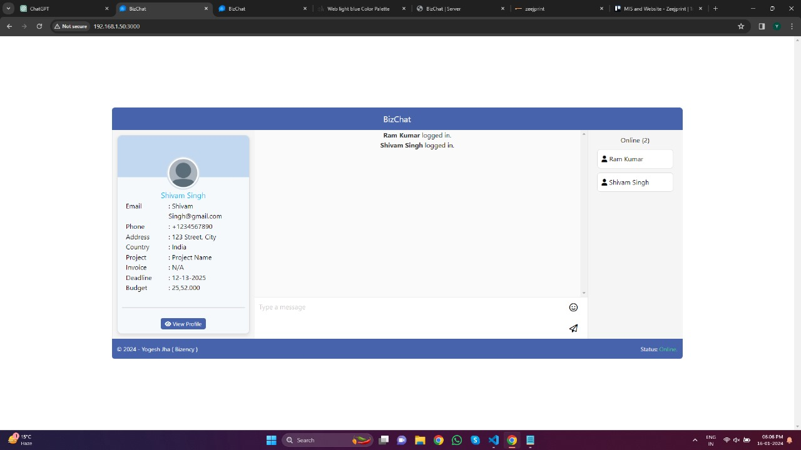

# BizChat: Real-Time Chat Application



BizChat is a modern and feature-rich real-time chat application developed using React for the frontend, Socket.io for real-time communication, and a Node.js server with MongoDB for database storage. It is designed to facilitate seamless communication between clients and support teams.

## Features

- Real-time chat functionality using Socket.io.
- User authentication for secure access.
- Easy integration with existing platforms or websites.
- MongoDB integration for robust and scalable data storage.

## Screenshots


*Caption for Screenshot 1*


*Caption for Screenshot 2*

## Video Demonstration

[](https://www.youtube.com/watch?v=your_video_id)
*Click the image above to watch the demonstration video.*

## Demo Flow Diagram (DFD)


*Data Flow Diagram illustrating the application's architecture.*

## Installation

Follow these steps to set up BizChat on your local machine:

1. Clone the repository:
   ```bash
   git clone https://github.com/your-username/BizChat.git
   cd BizChat
   ```

2. Install dependencies:
   ```bash
   npm install
   ```

3. Start the application:
   ```bash
   npm start
   ```

Visit `http://localhost:3000` in your browser to access the application.

## Usage

1. Register or log in to start using the chat features.
2. Explore the real-time chat functionality.
3. Customize and integrate BizChat with your existing platform.

## Contribution

We welcome contributions! If you'd like to contribute to BizChat, please follow our [contribution guidelines](CONTRIBUTING.md).

## License

This project is licensed under the MIT License - see the [LICENSE](LICENSE) file for details.

---

**Note:** Replace placeholder content (like `your-username`, `your_video_id`, and filenames) with your actual information.

Feel free to customize the README further to meet the specific details and nuances of your application.
```

Replace the placeholder content (like `your-username`, `your_video_id`, and filenames) with your actual information. Additionally, make sure to include actual image files for the screenshots, video thumbnail, BizChat logo, and DFD image in the appropriate paths.
